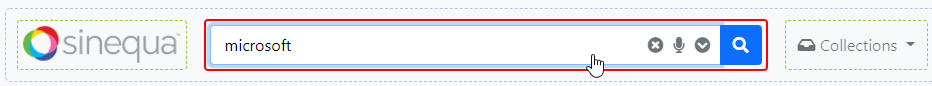
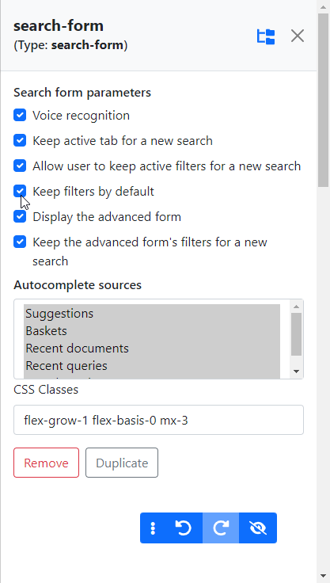
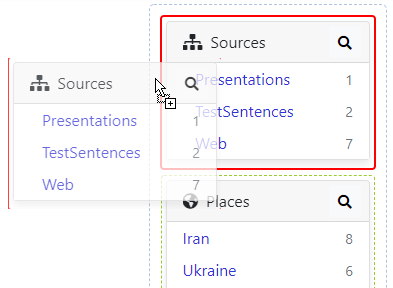
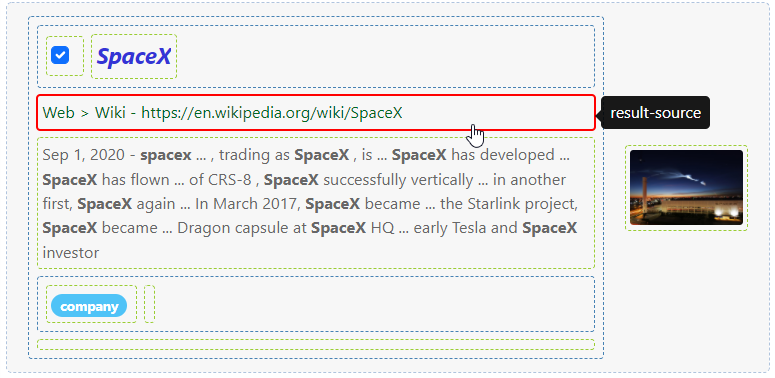
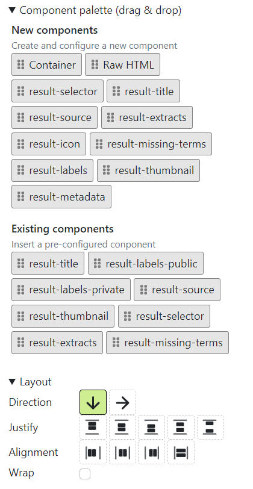
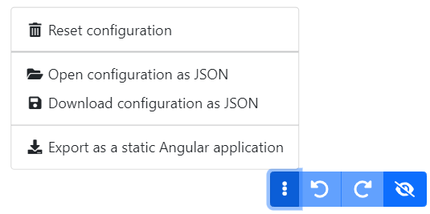
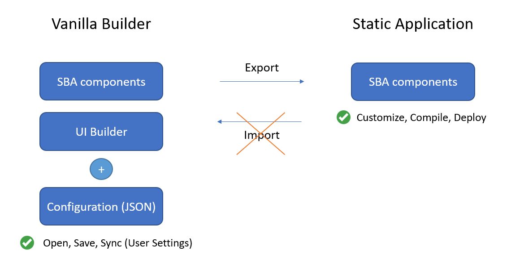
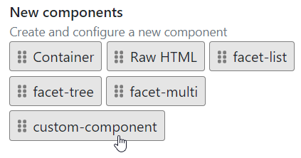
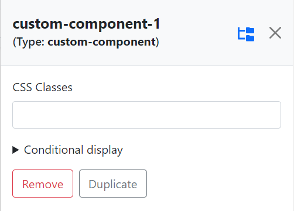
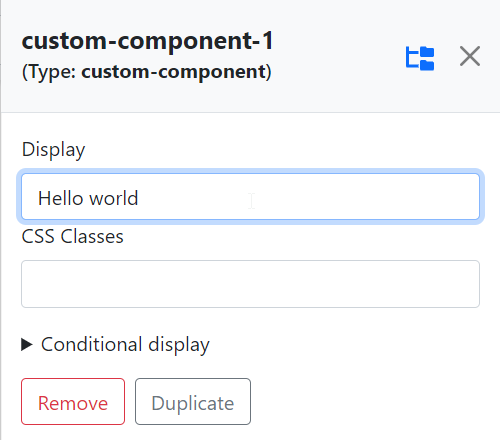

[](https://github.com/sinequa/sba-vanilla-ui-builder/actions/workflows/node.js.yml)

# Vanilla Builder

Vanilla Builder is an application based on [ngx-ui-builder](https://github.com/sinequa/ngx-ui-builder) and the [SBA framework](https://sinequa.github.io/sba-angular/).

Vanilla Builder is designed to let Sinequa administrators quickly generate and customize Search-Based Applications without writing code.

## Getting started

Vanilla Builder can be built and deployed like any regular SBA in Sinequa:

- Clone this repository
- Run `npm install --legacy-peer-deps`
- Run `npm run build` (to build the app) or `npm run start` (to serve the app locally)

Note that you may also need to setup your `startConfig` variable (inside `projets/vanilla/src/app/app.module.ts`).

Optionally, to enable the export of the application as a static SBA (see [below](#static-export)), deploy the attached `UiBuilderPlugin.cs` plugin on your Sinequa server.

## Usage

Vanilla Builder looks just like a regular Vanilla Search application. But, under the scene, components are configurable and can be moved around by drag-and-drop.

On the search route, click on the bottom-right button to activate the UI Builder.


Notice that dashed lines appear around some areas of the UI. These areas are configurable. When you click on them, you have access to their configuration options.



A configurator appears on the right part of the screen. Use the configurator to customize the parameters of your components. The configuration is automatically saved on the Sinequa server, but it can also be downloaded as a JSON file from the bottom-right toolbar.



Additionally, components can be move around in the UI via drag and drop. A component can only be moved within its general area (so you cannot move the "search-form" component inside the result list).



An area has at least one "container" within which components can be reordered. Containers can include sub-containers (etc.), which allows creating complex layouts.



Containers have a special built-in configurator, with various options, such as a palette of components that you can drag & drop in the User Interface, and layout parameters that can be used to customize how components are displayed.



When a change is made to the configuration, or the layout of the page, this change is automatically saved on the Sinequa server. It is possible to download the complete configuration as a JSON file, in order to reopen it later or to share it with somebody.



The last option allows you to export the customized application as a "static" application, which can be deployed somewhere else.

## Static export

The **ngx-ui-builder** library makes applications configurable at a cost:
- The application becomes very "dynamic": We determine which components are displayed at runtime, when we load the configuration.
- The source code of the application is more complex than a regular Sinequa SBA.

To cope with this, the "dynamic" application can be transformed into a "static" application, by removing all the ngx-ui-builder code from the Angular HTML template, and replacing it with static code, resulting from the configuration.

After this transformation, the configuration is not needed: all that remains is a normal application that can be edited, compiled and deployed as needed.



Note that this export is a one-way ticket: you cannot go back from Angular source code to configuration (but of course, you can keep the configuration and do multiple exports, as needed).

## Customization

Adding a custom component is done by inserting a new `<ng-template>` block inside one of the "zones" of the application. Currently there are 4 zones in the search component: The header, the facet bar, the results toolbar and the results list.

If we want to add a component to the facet bar, we would do something like:

```html
<uib-zone id="facets">

    ...

    <ng-template uib-template="custom-component">
        <h1>My custom component!!!</h1>
        <div>Hello world</div>
    </ng-template>

</uib-zone>
```

At this point, if you select your facet bar, you will see your custom component in the palette:



You can go one step further, and display your component by default, at the top of the facet bar. To do that, you must customize the app's default configuration, which is defined in app/app-config.service.ts. For example, at the end of `getDefaultConfig()`, you could add the following lines:

```ts
config.find(c => c.id === "facets")
    ?.items?.unshift("custom-component");
```

Implicitly, this creates a configuration object for your component:

```ts
{
    id: "custom-component",
    type: "custom-component"
}
```

But you could create this configuration object explicitly, in order to add custom properties:

```ts
config.push({
    id: "my-custom-component",
    type: "custom-component",
    display: "Hello world"
})
config.find(c => c.id === "facets")
    ?.items.unshift("my-custom-component");
```

With this new `display` property, you could modify the template like this:

```html
<ng-template uib-template="custom-component" let-config>
    <h1>My custom component!!!</h1>
    <div>{{config.display}}</div>
</ng-template>
```

You probably want to be able to customize this `display` property. To do that, you need to define a "configurator" for your custom component. By default, when you select your component, the configurator contains almost nothing:



Custom configurators can be passed to the `<uib-configurator>` component. For example, let's just add a text `<input>` to customize our property:

```html
<uib-configurator>

    ...

    <ng-template uib-template="custom-component" let-context>
      <label class="form-label" for="display">Display</label>
      <input class="form-control" id="display"
        type="text"
        [(ngModel)]="context.config.display"
        (ngModelChangeDebounced)="context.configChanged()"
      />
    </ng-template>

</uib-configurator>
```

Now, we can edit the display property from our configurator:



And that is all there is to it!

Customizing the Vanilla Builder application simply means adding, removing or editing the `ng-template` elements, adding new properties to the configuration, and making them editable via custom configurators.
